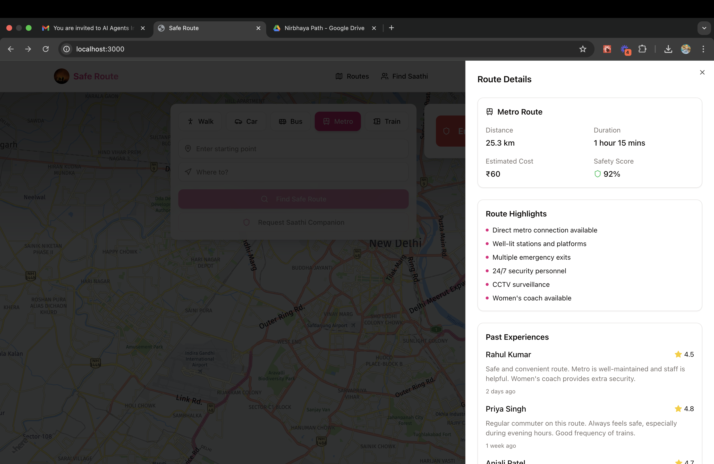

# Women Safety App - Saathi

A comprehensive women safety application that provides real-time route planning, safety features, and verified companions (Saathis) for safer travel.

## 🌟 Features

- **Smart Route Planning**
  - Real-time route calculation with safety scores
  - Multiple transport modes (Walking, Car, Bus, Metro, Train)
  - Safety-focused route recommendations
  - Detailed route information and highlights

- **Saathi Companion System**
  - Verified companion matching
  - Real-time location sharing
  - In-app communication
  - Emergency contact alerts
  - Safety ratings and reviews

- **Safety Features**
  - Emergency SOS button
  - Live location tracking
  - Safe spot identification
  - Emergency contact management
  - Route safety scoring

## 🚀 Installation Guide

### Prerequisites

- Node.js (v18 or higher)
- npm or yarn
- HERE Maps API key
- MongoDB

### Backend Setup

1. Navigate to the server directory:
   ```bash
   cd server
   ```

2. Install dependencies:
   ```bash
   npm install
   ```

3. Create a `.env` file in the server directory with the following variables:
   ```env
   PORT=5000
   MONGODB_URI=your_mongodb_uri
   JWT_SECRET=your_jwt_secret
   HERE_MAPS_API_KEY=your_here_maps_api_key
   ```

4. Start the server:
   ```bash
   npm run dev
   ```

### Frontend Setup

1. Navigate to the client directory:
   ```bash
   cd client
   ```

2. Install dependencies:
   ```bash
   npm install
   ```

3. Create a `.env` file in the client directory:
   ```env
   VITE_API_URL=http://localhost:5000
   VITE_HERE_MAPS_API_KEY=your_here_maps_api_key
   ```

4. Start the development server:
   ```bash
   npm run dev
   ```

## 🔑 Environment Variables

### Backend (.env)

```env
PORT=5000                    # Server port
MONGODB_URI=                 # MongoDB connection string
JWT_SECRET=                  # Secret key for JWT tokens
HERE_MAPS_API_KEY=          # HERE Maps API key
```

### Frontend (.env)

```env
VITE_API_URL=               # Backend API URL
VITE_HERE_MAPS_API_KEY=     # HERE Maps API key
```

## 📸 Screenshots

### Main Interface with Route Planning

*Main interface showing route planning with multiple transport modes and emergency SOS button*

### Route Details with Safety Information

*Detailed route information showing safety score, highlights, and past user experiences*

## 🛠️ Tech Stack

- **Frontend**
  - React
  - TypeScript
  - Tailwind CSS
  - HERE Maps API
  - Shadcn UI

- **Backend**
  - Node.js
  - Express
  - MongoDB
  - JWT Authentication
  - HERE Maps API

## 🤝 Contributing

1. Fork the repository
2. Create your feature branch (`git checkout -b feature/AmazingFeature`)
3. Commit your changes (`git commit -m 'Add some AmazingFeature'`)
4. Push to the branch (`git push origin feature/AmazingFeature`)
5. Open a Pull Request 